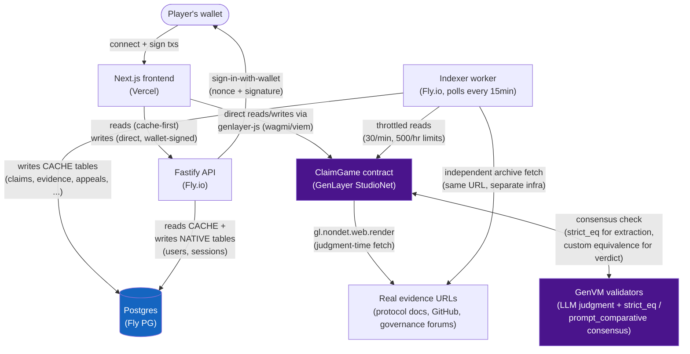

# CLAIMGAME — SYSTEM ARCHITECTURE SPECIFICATION

Status: **This is the original Phase-2 discovery-phase design document, written before implementation began and never updated afterward.** The system described below has since been fully built, deployed, and live-tested (v0.3.10, contract `0x7669F31fe5B91E7e7661f6C88a53351fb29662D1` on GenLayer StudioNet) — do not read the "awaiting approval" framing, method names, or table names below as current; several evolved during implementation (e.g. this doc's `settle_human_agreement` is `propose_human_settlement` in the real contract; the `stakes` table described in §15 doesn't exist as named — challenge stakes are tracked on the `challenges` table instead). For what's actually true today: [docs/genlayer.md](./genlayer.md) (contract behavior, version history, capability matrix), [`contracts/claimgame/contract.py`](../contracts/claimgame/contract.py) (source of truth for every method), [`apps/api/prisma/schema.prisma`](../apps/api/prisma/schema.prisma) (actual database schema), and [`tests/`](../tests/) (actual test suite). This document is kept for historical/product-intent context, not as a current reference.

Tagline: *"Put money behind your interpretation of a protocol."*

Confirmed decisions from Phase 0 discovery:

| Area | Decision |
|---|---|
| Database | Self-managed PostgreSQL |
| Postgres hosting | Fly Postgres (Fly-managed cluster, container-based under the hood, no hand-rolled Dockerfile) |
| Backend hosting | Fly.io (long-lived process, `[[services]] auto_stop_machines = false` / min_machines_running ≥ 1 → 24/7) |
| Auth | Wallet-based (connect + sign nonce, no custodial keys) |
| Social linking | **None** — dropped per your instruction. No OAuth-linked socials in v1. |
| Frontend | Next.js 14 (App Router) + TypeScript + Tailwind, deployed on Vercel |
| Blockchain | GenLayer Intelligent Contract on **StudioNet**, GEN as the native asset |
| Backend framework | Node.js + Fastify + Prisma (typed, matches TS frontend, first-class Fly deploy) |

Because auth is wallet-based, there is **no custodial wallet problem to solve** — the private key never leaves the user's own wallet (MetaMask/Rainbow/etc). This removes the entire "Option 1" custody/export/encryption subsystem from the spec; the wallet architecture section below covers the sign-in-with-wallet flow instead.

---

## 1. Product Architecture

CLAIMGAME is a three-layer system:

```
FRONTEND (Next.js/Vercel)          — presentation, wallet interaction, UX
        │
BACKEND (Fastify/Fly.io + Postgres) — identity, indexing, search, notifications, reputation cache
        │
GENLAYER CONTRACT (StudioNet)       — canonical claim state, bonds, evidence-gated judgment, payouts
```

The backend is **never** the source of truth for anything involving GEN, bonds, verdicts, or claim resolution — it is a read-optimized mirror plus off-chain conveniences (search, notifications, profile metadata). The contract is authoritative. This is enforced by a background **indexer** that only ever writes to Postgres by replaying GenLayer contract events/state — the API never accepts a client-supplied "this claim was resolved" write.

## 2. System Architecture



Three Fly.io machines, one app group: `api` (Fastify), `indexer` (polling worker), `pg` (Fly Postgres cluster, 1 primary + optionally 1 replica for read scaling later). `min_machines_running = 1` on `api` and `indexer` guarantees the "backend must be on 24/7" requirement — Fly does not cold-stop them. The indexer and the contract fetch evidence URLs INDEPENDENTLY of each other (v0.3.8) — the contract's fetch is what the judgment actually sees and hashes on-chain; the indexer's fetch is a separate archival copy, verified against the contract's hash but not the same network call.

## 3. User Journeys

**Claimer:** connect wallet → browse Hunt Board → open "New Claim" → pick protocol/category → write source statement + canonical interpretation → attach evidence → set bond → optional bounty → sign contract tx → claim goes OPEN.

**Challenger:** browse Hunt Board → open a claim → read evidence board + declared vs observed reality → find a contradiction → write challenge + attach evidence → set stake → sign tx → claim moves to CHALLENGED.

**Defender:** notified/opts in → submits counter-evidence or an amended interpretation (new version) → sign tx.

**Resolution (any eligible party):** once challenge window elapses or both sides indicate readiness → "Submit case for judgment" → contract triggers GenLayer LLM evaluation with web-fetch of cited evidence URLs → validators reach Optimistic-Democracy consensus → verdict written on-chain → bonds/stakes settle automatically → reputation events emitted → indexer mirrors everything to Postgres → UI shows the resolution screen.

## 4. Game Mechanics (economics detail now lives directly in `contracts/claimgame/contract.py`'s constants and comments — e.g. `MIN_CLAIM_BOND_WEI`, `MIN_CHALLENGE_MULTIPLIER_BPS`, `APPEAL_BOND_WEI` — no separate game-economy.md was ever created)

Claim → Challenge → Evidence → Judgment → Resolution → Reputation → Progression, exactly as specified in ClaimGame.md. Difficulty (EASY/AMBIGUOUS/HARD/EXTREME) is **derived**, not author-set: computed from (a) number of independent evidence sources, (b) whether declared-vs-observed contradictions exist, (c) historical semantic-precedent similarity. The backend computes this score from indexed data; it is cosmetic metadata, never fed back into the contract as authoritative.

## 5. Claim Lifecycle (state machine, canonical, lives in the contract)

```
DRAFT (client-side only, not on-chain)
  → OPEN            (claim tx confirmed, bond locked)
  → CHALLENGED       (a challenge bond locked against it)
  → UNDER_REVIEW      (either party calls "submit for judgment")
  → RESOLVED_MERGE | RESOLVED_REJECT | RESOLVED_PARTIAL | NEEDS_HUMAN_REVIEW
  → EXPIRED          (challenge window closed, no challenge raised)
  → WITHDRAWN        (claimant withdraws before any challenge)
```

`NEEDS_HUMAN_REVIEW` is the low-confidence fallback (see §8). It is a terminal-for-automation, non-terminal-for-funds state: funds stay locked until a follow-up `settle_human_agreement` (mutual sign-off) or a timeout-based recovery path fires (§9).

## 6. Challenge Lifecycle

Challenge = a bonded counter-interpretation attached to an existing claim, referencing specific evidence. One active challenge per claim at a time (prevents an unbounded pile-on); additional challengers can co-sign/add evidence to the existing challenge rather than opening a competing one — this is an anti-spam measure (§ Economic Security).

## 7. Evidence Lifecycle

Evidence items are submitted off-chain-content, on-chain-referenced: the **URL/hash/tx-reference** is what's stored on-chain (cheap, immutable pointer); the actual page content is fetched live by the contract's web-access capability at judgment time — never trusted from the submitter's own restated text. This directly satisfies the review team's "must check real evidence, not user-submitted text alone" requirement. Screenshots/images are pinned (IPFS or equivalent content-addressed store, referenced by hash) and passed through GenLayer's image-input capability at judgment time if the model needs to inspect them.

## 8. GenLayer Judgment Lifecycle

1. `submit_for_judgment(claim_id)` called on-chain.
2. Contract's nondeterministic block runs: fetch each cited evidence URL live (`gl.nondet.web.render` / equivalent per current docs), assemble a structured prompt containing: source statement, canonical interpretation, challenge argument, evidence excerpts (fetched, not submitter-restated), explicit instruction to output structured JSON.
3. Each validator runs the same nondeterministic block independently (Optimistic Democracy) and the Equivalence Principle reconciles outputs into consensus.
4. Contract parses the structured result into `{verdict, confidence, payout_bps, reasoning_summary}`.
5. Branch on verdict + confidence per §9.
6. State transition + fund settlement + reputation event, all inside the same call, ledger-zero-then-transfer ordered (see §17 Contract Architecture).

This is the part conventional deterministic code cannot do: judging whether a natural-language interpretation is faithful to a source statement, given contradicting real-world evidence, is exactly the class of problem GenLayer's LLM+consensus model exists for — not "better AI answers" as a product (which the review explicitly disallows), but a **contract-enforced, validator-checked outcome** that moves real GEN.

## 9. Safety / Low-Confidence Handling

```
verdict == PASSED  and confidence == HIGH        → RESOLVED_MERGE  (challenger loses bond to claimant... see economics)
verdict == FAILED  and confidence == HIGH        → RESOLVED_REJECT
verdict == PARTIAL and confidence >= MEDIUM       → RESOLVED_PARTIAL (bps split)
confidence == LOW  OR malformed OR evidence       → NEEDS_HUMAN_REVIEW
  unreachable OR contradictory sub-results
```

`NEEDS_HUMAN_REVIEW` never auto-releases funds. It requires **either**:
- `settle_human_agreement(claim_id, payout_bps)` — both claimant and challenger co-sign (two separate txs, contract checks both addresses submitted matching terms) — mutual agreement path, **or**
- `claim_dispute_timeout(claim_id)` after a configurable review-timeout window (e.g. 7 days) — funds return to their original depositors 50/50-of-what-they-put-in (reward back to sponsor-side context aside — for ClaimGame specifically: claim bond back to claimant, challenge stake back to challenger; nobody profits from an inconclusive case). This guarantees no fund is ever permanently stuck, satisfying the review team's "must not lead to an undetermined status" requirement without making the contract too strict to reach consensus — the contract doesn't require a clean verdict to make progress, it just requires *some* path to always terminate.

## 10. Bond / Economic Model — see the constants block at the top of `contracts/claimgame/contract.py` for actual current values (no separate game-economy.md exists)

Summary of flows (full attack analysis in that doc):
- **Claim bond**: locked by claimant on `create_claim`.
- **Challenge stake**: locked by challenger on `submit_challenge`, must be ≥ claim bond (skin-in-the-game floor, discourages frivolous challenges).
- **Bounty** (optional): sponsor-funded pool, split by role (challenger / evidence contributors / final interpreter) per predefined bps table set at bounty creation — **not** discretionary at resolution time, to remove a manipulation vector.
- All payouts route through one `_send_gen()` choke point, ledger-zeroed-before-transfer, mirroring the ShipBond/ic7 pattern you referenced (§17).

## 11. Reputation Architecture

Three tracked dimensions per user, computed **off-chain** in Postgres from indexed on-chain resolution events (reputation itself is not stored in the contract — it's a derived analytics product, cheap to recompute, doesn't bloat contract state):
- Interpretation Accuracy = MERGE-resolved claims ÷ total resolved claims authored, weighted by opposing stake size (a claim nobody challenged counts less than one that survived a well-staked challenge).
- Challenge Accuracy = successful challenges ÷ total challenges raised, same stake-weighting.
- Evidence Reliability = (evidence items cited in a winning verdict's reasoning) ÷ (total evidence items submitted by that user).

Anti-gaming: self-challenge is blocked at the contract level (`challenger != claim.creator`, and same-wallet-cluster heuristics flagged off-chain for manual review); reputation from claims with stake below a spam floor is discounted to near-zero; a rolling-window Sybil-resistance decay discounts reputation gained from wallets with a very new claim history colluding on the same protocol repeatedly.

## 12. Economy Architecture — folded into §10 above; no separate game-economy.md exists

## 13. Authentication Architecture

Sign-In-With-Wallet, EIP-4361-style:
1. Client requests a nonce from `POST /api/auth/nonce` (Fastify generates, stores server-side with 5-min TTL, tied to the wallet address).
2. Client signs a structured message (`domain, address, nonce, issuedAt, chainId`) with the connected wallet.
3. `POST /api/auth/verify` recovers the signer, checks it matches the claimed address and the nonce is unexpired/unused, issues a short-lived JWT (httpOnly, secure cookie) + refresh token.
4. All subsequent API calls (profile, notifications, non-authoritative UI data) use the JWT. All **contract writes** happen client-side via the user's own wallet — the backend never signs or relays transactions on the user's behalf.

Session expiry: 24h access token, 30-day refresh, revocable server-side (refresh-token table in Postgres). Wallet switching invalidates the session for the old address and requires re-verification for the new one.

## 14. Wallet Architecture

No custody. Supported connectors: MetaMask, Rainbow, WalletConnect-compatible (via a connector kit in the frontend, e.g. RainbowKit/wagmi-style, verified against GenLayer's current recommended frontend SDK during Phase 9). Users can connect exactly one wallet per session; multi-wallet linking to a single profile is out of scope for v1 (documented as a deliberate cut, not a TODO).

## 15. Database Architecture (Postgres — Fly Postgres)

Authoritative-vs-cached separation: every table below is either **CACHE** (derived, safe to wipe and re-index from chain) or **NATIVE** (only exists off-chain, e.g. notification preferences).

Core tables: `users` (NATIVE — wallet_address PK, created_at, display_name, avatar_url), `sessions` (NATIVE — refresh tokens), `claims` (CACHE — mirrors on-chain claim struct + derived difficulty score), `claim_versions` (CACHE — version history), `evidence` (CACHE — pointer + fetched-content hash + verification status), `challenges` (CACHE), `objections` (CACHE), `stakes` (CACHE — who bonded what, per claim), `resolutions` (CACHE — verdict, confidence, reasoning summary, tx hash), `reputation_events` (CACHE — one row per resolution, source of truth for §11 aggregates), `reputation_scores` (CACHE — materialized rollup, refreshed by indexer), `leaderboards` (CACHE — per-season materialized view), `seasons` (NATIVE — season definitions/date ranges, admin-managed), `notifications` (NATIVE), `protocols` (NATIVE — curated list of protocols claims can reference, admin-extensible), `indexer_cursor` (NATIVE — last-processed block/event id, single row, drives resumable indexing).

Every CACHE table carries `contract_tx_hash`, `synced_at`, and is uniquely keyed by the on-chain claim/entity id — never an auto-increment used as the source of truth for anything financial. Full column-level schema with FKs/indexes/constraints lives in [`apps/api/prisma/schema.prisma`](../apps/api/prisma/schema.prisma) — the actual, current source of truth (no separate database.md was created; the schema file supersedes it).

## 16. API Architecture

REST, versioned under `/api/v1`. JSON:API-ish but pragmatic — plain JSON envelopes: `{data, meta, error}`. Auth via JWT cookie for writes to NATIVE tables; CACHE-table reads are public/unauthenticated (claims, evidence, leaderboards are public info). Pagination: cursor-based (`?cursor=&limit=`, max limit 50). Rate limiting: per-IP + per-wallet token bucket (Fastify rate-limit plugin, backed by Postgres or in-memory since single-region initially). Idempotency: write endpoints that trigger notifications/side-effects accept an `Idempotency-Key` header. Full endpoint list ships in [api.md](./api.md).

## 17. Frontend Architecture

Next.js App Router, route groups mirroring the five prototype screens you supplied plus the pages ClaimGame.md requires that weren't prototyped (claim creation wizard, challenge/defense flows, resolution screen, profile, notifications, settings). Server Components for data-heavy read views (Hunt Board, Leaderboard, claim detail shell); Client Components for wallet-interactive pieces (stake input, sign-and-submit buttons, live transaction status). State: React Query for server cache, wagmi (or GenLayer's equivalent connector) for wallet/chain state, no global Redux — not needed at this scope. Design system extracted from your DESIGN.md/prototypes into a shared Tailwind config + component library (`packages/ui`), covering every screen ClaimGame.md lists (see §"Frontend Requirements" mapping in ux.md).

## 18. GenLayer Architecture / 19. Contract Architecture

One Intelligent Contract, `ClaimGame`, deployed to StudioNet. Before writing it I will pull current syntax from https://docs.genlayer.com/developers/intelligent-contracts/ideas, https://docs.genlayer.com/, and https://skills.genlayer.com/ — per your instruction, documentation wins over anything I remember. Contract responsibilities: claim/challenge/evidence-reference storage, bond/stake custody (payable writes, ledger fields separate from terms — exactly the pattern from the ShipBond excerpt and your ic7 project's verdict handling you referenced), `submit_for_judgment` nondeterministic block with **live contract-side web fetch** of evidence (not user-submitted text), Equivalence-Principle-reconciled structured verdict, the `NEEDS_HUMAN_REVIEW` fallback with a guaranteed-terminating timeout/mutual-agreement path (§9), and reputation-event emission. Target size: a genuine ~1000+ line production contract (not padded) covering the full claim state machine, five payout exit paths (merge / reject / partial / human-agreement / dispute-timeout), and defensive prompt construction around fetched evidence to resist adversarial page content. Full contract design doc: [genlayer.md](./genlayer.md), written and validated against current docs before Phase 5 code.

## 20. Security Architecture / 25. Threat Model — see [threat-model.md](./threat-model.md)

## 21. Deployment Architecture

Frontend → Vercel (git-connected, preview deploys per PR). Backend `api` + `indexer` → Fly.io (`fly.toml` per app, `min_machines_running=1`, health checks, auto-restart). Database → Fly Postgres (`fly postgres create`, attached to `api`/`indexer` via `fly postgres attach`, daily backups via Fly's built-in snapshotting). Contract → GenLayer Studio CLI to StudioNet, **you deploy and hand me the address** — I never deploy it myself, per your instruction. Once you give me the deployed address, I store it as `NEXT_PUBLIC_CLAIMGAME_CONTRACT_ADDRESS` (frontend) and `CLAIMGAME_CONTRACT_ADDRESS` (backend indexer) — never hardcoded inline. Full step-by-step procedure (including exactly which commands, in which order, and the real operational gotchas hit along the way): [deployment-runbook.md](./deployment-runbook.md). CI (typecheck, build, deterministic tests, GenVM lint) runs on every PR via `.github/workflows/ci.yml`.

## 22. Environment Configuration

`.env.example` at repo root + per-app `.env.example` (web, api). Public/prefixed vars only in `apps/web/.env.local` (`NEXT_PUBLIC_*`); all secrets (DB URL, JWT signing secret, GenLayer RPC key if any) live in Fly secrets (`fly secrets set`) and Vercel's encrypted env vars — never committed.

## 23. Folder Structure

```
CLAIMGAME/
├── apps/
│   ├── web/                 # Next.js frontend (Vercel)
│   └── api/                 # Fastify backend + indexer worker (Fly.io)
├── contracts/
│   └── claimgame/           # the single Intelligent Contract + its tests
├── packages/
│   ├── ui/                  # shared Tailwind design system (from your prototypes)
│   ├── config/              # shared eslint/tsconfig
│   └── types/               # shared TS types (claim/challenge/evidence DTOs)
├── scripts/                 # Python file-op scripts, per your workflow requirement
├── tests/                   # cross-cutting integration/e2e tests
├── docs/                    # this file + architecture.md siblings
├── .env.example
├── .gitignore
├── README.md
└── package.json             # pnpm workspace root
```
Monorepo (pnpm workspaces + Turborepo) because web/api/contract share types and this keeps the "no fake blockchain" contract types in sync across layers automatically.

## 24. Testing Strategy / 27. Development Milestones — no separate testing.md or ClaimGame.md exist. Current testing strategy: deterministic unit tests in [`tests/`](../tests/) (`python3 -m unittest discover -s tests`, `node tests/test_vote_decoding.mjs`, `node tests/test_cid.mjs`), live StudioNet integration scripts in [`scripts/`](../scripts/), and the full version-by-version live-test history in [docs/genlayer.md](./genlayer.md).

## 26. Economic Attack Model — see [docs/threat-model.md](./threat-model.md) for the current, maintained threat model (covers evidence/consensus manipulation, SSRF, fund-safety invariants; does not use the Sybil/collusion/reputation-farming framing this section originally proposed — no separate game-economy.md was created).

---

### What I need from you to proceed

1. **Approve or amend this architecture.** Nothing gets built until you say go.
2. GEN bond floors are set directly as constants in `contracts/claimgame/contract.py` (e.g. `MIN_CLAIM_BOND_WEI = 10 GEN`) — no separate game-economy.md was created.
3. Confirm you're OK with **no social-linking in v1** (you said not needed) — profile identity is wallet-address + optional self-set display name only.
4. When we reach Phase 14, **you deploy the contract to StudioNet and give me the address** — I will not attempt to deploy it.

If approved, next deliverable is Phase 3 (UX/UI architecture: full page-by-page spec, navigation, component inventory, responsive/interaction states) followed by Phase 4 (project scaffold via Python scripts, per your file-operation workflow).
